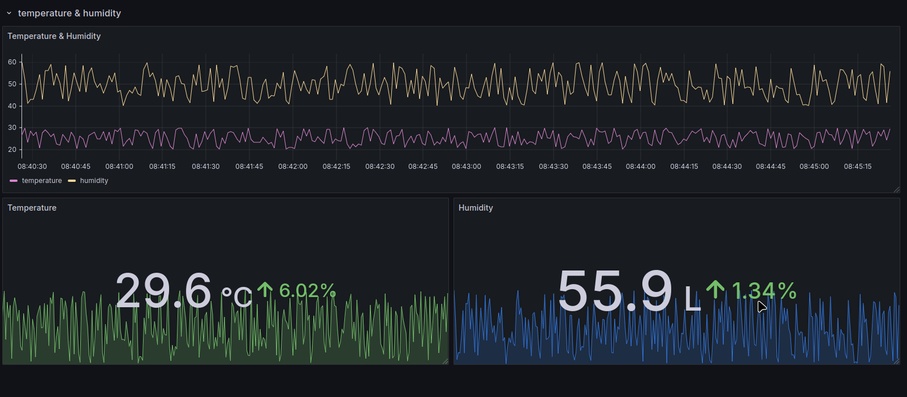

# Kafka to InfluxDB Data Pipeline

This project demonstrates how to stream data from Kafka to InfluxDB using Docker, Python, and Grafana for visualization. The Kafka producer generates random sensor data, which is consumed by a Python Kafka consumer and stored in InfluxDB. Grafana is used to visualize the data stored in InfluxDB.

## Project Overview

- **Kafka**: Used for messaging between the producer and the consumer.
- **InfluxDB**: Used for storing the sensor data.
- **Grafana**: Used to visualize the data stored in InfluxDB.
- **Docker Compose**: Used to manage the services and containers for Kafka, InfluxDB, and Grafana.

## Architecture

1. **Kafka Producer**: Simulates sensor data (temperature and humidity) and sends it to Kafka.
2. **Kafka Consumer**: Consumes the data from Kafka and writes it to InfluxDB.
3. **InfluxDB**: Stores the sensor data in a time-series database.
4. **Grafana**: Visualizes the data stored in InfluxDB on a dashboard.


## Getting Started

### 1. Clone the Repository

Clone the repository to your local machine:

```bash
git clone https://github.com/yourusername/kafka-influxdb-grafana.git
cd kafka-influxdb-grafana
```

**IMPORTANT: change the token and respective IP's for producer and consumer once you setup influxdb and your bucket (http://localhost:8086)**

### 2. Set Up Docker Compose

The `docker-compose.yml` file is configured for the following services:

- **Kafka**: Message broker.
- **InfluxDB**: Time-series database for storing sensor data.
- **Grafana**: Dashboard to visualize sensor data.

### 3. Start the Services

Run the following command to start all the services:

```bash
docker-compose up -d
```

This will pull the required images and start Kafka, InfluxDB, and Grafana in detached mode.

### 4. Configure Grafana

Once the services are running, navigate to the Grafana web interface:

```url
http://localhost:3000
```

- **Username**: `admin`
- **Password**: `admin`

Add InfluxDB as a data source:
1. Go to **Configuration** > **Data Sources**.
2. Add **InfluxDB** as the data source.
3. Use the following settings:
   - **URL**: `http://influxdb:8086`
   - **bucket**: `sensor_data`
   - **bucket**: `token`
   - **Authentication**: Use **Basic Auth** with your InfluxDB credentials.

### 5. View the Dashboard

Once the data source is set up, you can create or import a dashboard to visualize the data.

### 6. Kafka Producer and Consumer

The Kafka producer sends random sensor data (temperature and humidity) to Kafka, and the consumer reads the data and writes it to InfluxDB. To start the producer and consumer:

- **Producer**: Sends random data to Kafka. It runs in a loop.
- **Consumer**: Reads the Kafka messages and writes the data to InfluxDB.

You can start the producer and consumer by running the following commands:

#### Producer (in one terminal):

```bash
python producer.py
```

#### Consumer (in another terminal):

```bash
python consumer.py
```

### 7. Example Grafana Dashboard


```bash
from(bucket: "sensor_data")
  |> range(start: -1h)
  |> filter(fn: (r) => r["_measurement"] == "environment" and r["_field"] == "temperature")
```

```bash
from(bucket: "sensor_data")
  |> range(start: -1h)
  |> filter(fn: (r) => r["_measurement"] == "environment" and r["_field"] == "humidity")
```
## License

This project is licensed under the MIT License - see the [LICENSE](LICENSE) file for details.

---

